# 🌊 Weather Engine Maritime
## Complete Free Deployment Guide

<div align="center">


</div>

---

## 📋 Quick Navigation

| Step | Platform | Time | Difficulty |
|------|----------|------|------------|
| [1️⃣](#step-1-prepare-your-repository) | GitHub | 5 min | ⭐ |
| [2️⃣](#step-2-deploy-backend-on-railway) | Railway | 10 min | ⭐⭐ |
| [3️⃣](#step-3-deploy-frontend-on-vercel) | Vercel | 5 min | ⭐ |
| [4️⃣](#step-4-configure-api-endpoints) | Config | 3 min | ⭐ |

---

## 🚀 Step 1: Prepare Your Repository

<details>
<summary><b>🔧 Git Setup Commands</b></summary>

```bash
# Navigate to your project directory
cd /Users/gewu/Desktop/weather-engine-maritime

# Initialize Git repository
git init

# Stage all files
git add .

# Create initial commit
git commit -m "🚀 Initial commit - Weather Engine Maritime MVP"

# Set main branch
git branch -M main

# Add remote origin
git remote add origin https://github.com/YOUR_USERNAME/weather-engine-maritime.git

# Push to GitHub
git push -u origin main
```

</details>

> ⚡ **Pro Tip**: Replace `YOUR_USERNAME` with your actual GitHub username

---

## 🚂 Step 2: Deploy Backend on Railway

<div align="center">

### Railway Deployment Flow

```mermaid
graph TD
    A[🔗 Sign Up Railway] --> B[📂 Connect GitHub]
    B --> C[⚙️ Configure Build]
    C --> D[🌐 Get Backend URL]
    D --> E[✅ Backend Live]
    
    style A fill:#0066cc,color:#fff
    style E fill:#00cc66,color:#fff
```



</div>

### 🔗 Railway Setup

1. **Sign Up**: [railway.app](https://railway.app)
   - Use GitHub account for seamless integration
   - **Free Tier**: 500 hours/month ⏰

2. **Create New Project**:
   ```
   New Project → Deploy from GitHub repo → Select weather-engine-maritime
   ```

3. **Environment Variables**:
   
   | Variable | Value | Purpose |
   |----------|--------|---------|
   | `PORT` | `8000` | Server port |
   | `PYTHONPATH` | `/app/backend` | Python path |
   | `OWM_KEY` | `your_api_key` | Weather API (optional) |

4. **Build Configuration**:
   - **Build Command**: `pip install -r backend/requirements.txt`
   - **Start Command**: `python backend/main.py`
   - **Root Directory**: `/` (default)

### 🎯 Expected Output

```
✅ Railway URL: https://your-app-name.railway.app
✅ API Status: https://your-app-name.railway.app/
✅ Route Forecast: https://your-app-name.railway.app/route_forecast
```

---

## 🌐 Step 3: Deploy Frontend on Vercel

<div align="center">

### Vercel Deployment Pipeline

```
GitHub Repository → Vercel Import → Auto Deploy → Live URL
     📂              ⚙️            🚀         🌐
```

</div>

### ⚙️ Vercel Configuration

| Setting | Value | Notes |
|---------|--------|-------|
| **Framework** | Other | Custom setup |
| **Root Directory** | `frontend` | Frontend folder |
| **Build Command** | *(empty)* | Static files |
| **Output Directory** | *(empty)* | Default |

### 🔗 Deployment Steps

1. **Sign Up**: [vercel.com](https://vercel.com)
2. **Import Project**: GitHub → `weather-engine-maritime`
3. **Configure**: Set root directory to `frontend`
4. **Deploy**: Automatic deployment starts

---

## 🔗 Step 4: Configure API Endpoints

### 📝 Update Frontend Configuration

**File**: `frontend/demo.html`

```javascript
// Replace this line:
const API_BASE = 'http://localhost:8000';

// With your Railway URL:
const API_BASE = 'https://your-app-name.railway.app';
```

---

## 🔄 Alternative Deployment Options

<div align="center">

### Platform Comparison

| Platform | Free Tier | Build Time | Features |
|----------|-----------|------------|----------|
| **Railway** | 500h/month | ~2 min | Auto-sleep, Monitoring |
| **Render** | 750h/month | ~3 min | Custom domains |
| **Heroku** | 550h/month | ~4 min | Add-ons ecosystem |
| **Vercel** | Unlimited static | ~30s | Edge functions |
| **Netlify** | 100GB/month | ~1 min | Form handling |

</div>

### 🏗️ Backend Alternatives

<details>
<summary><b>🚀 Render Deployment</b></summary>

```bash
# Render setup
1. Visit: https://render.com
2. Connect GitHub repository
3. Set build command: pip install -r backend/requirements.txt
4. Set start command: python backend/main.py
```

</details>

<details>
<summary><b>🌐 Heroku Deployment</b></summary>

```bash
# Install Heroku CLI
npm install -g heroku

# Login and create app
heroku login
heroku create your-app-name

# Configure and deploy
heroku config:set PORT=8000
git push heroku main
```

</details>

### 🎨 Frontend Alternatives

- **GitHub Pages**: Free static hosting with custom domains
- **Surge.sh**: Simple command-line deployment
- **Firebase Hosting**: Google's fast CDN with SSL

---

## ⚡ Quick Deploy Commands

<div align="center">

### One-Click Deployment

</div>

### 🚂 Railway CLI

```bash
# Install Railway CLI
npm install -g @railway/cli

# Quick deploy
railway login
railway link
railway up
```

### 🌐 Vercel CLI

```bash
# Install Vercel CLI  
npm install -g vercel

# Deploy from frontend
cd frontend
vercel --prod
```

---

## 🧪 Testing Your Deployment

### 🔍 Backend Health Check

```bash
# Test API status
curl https://your-railway-app.railway.app/

# Test route forecast
curl https://your-railway-app.railway.app/route_forecast

# Expected response
{
  "status": "Weather Engine Maritime API",
  "version": "1.0",
  "endpoints": ["/", "/route_forecast"]
}
```

### 🎯 Frontend Validation

1. **Visit Frontend URL**: `https://your-project.vercel.app`
2. **Test Interactive Features**:
   - Route planning widgets
   - Weather data display  
   - API connectivity indicators

---

## 📊 Deployment Summary

<div align="center">

### 🎯 Final URLs

| Service | URL Pattern | Purpose |
|---------|-------------|---------|
| **Backend API** | `https://[app-name].railway.app` | Weather API endpoints |
| **Frontend Demo** | `https://[project].vercel.app` | Interactive interface |
| **Documentation** | `https://[project].vercel.app/docs` | API documentation |

### 💰 Cost Breakdown

```
Railway Backend:     $0.00/month (500 hours free)
Vercel Frontend:     $0.00/month (unlimited static)
Custom Domain:       $0.00/month (optional)
────────────────────────────────────────────────
Total Monthly Cost:  $0.00
```

</div>

---

## 🛠️ Troubleshooting Guide

### ❗ Common Issues

<details>
<summary><b>🔴 Railway Build Failures</b></summary>

**Problem**: `pip install` fails during build

**Solutions**:
- ✅ Verify `backend/requirements.txt` exists
- ✅ Check Python version compatibility  
- ✅ Review build logs in Railway dashboard

```bash
# Debug commands
railway logs
railway status
```

</details>

<details>
<summary><b>🔴 CORS Errors</b></summary>

**Problem**: Frontend cannot connect to backend

**Solutions**:
- ✅ Update CORS settings in backend
- ✅ Verify frontend URL in allowed origins
- ✅ Check network connectivity

```python
# Backend CORS fix
from fastapi.middleware.cors import CORSMiddleware

app.add_middleware(
    CORSMiddleware,
    allow_origins=["https://your-project.vercel.app"],
    allow_credentials=True,
    allow_methods=["*"],
    allow_headers=["*"],
)
```

</details>

<details>
<summary><b>🔴 Cold Start Delays</b></summary>

**Problem**: First request takes 30+ seconds

**Solutions**:
- ✅ Railway apps sleep after inactivity
- ✅ Use uptime monitoring services
- ✅ Implement keep-alive pings

```bash
# Keep-alive curl command
while true; do curl https://your-app.railway.app/ > /dev/null 2>&1; sleep 300; done
```

</details>

---

## 🚀 Advanced Configuration

### 🔧 Environment Variables

```bash
# Railway environment setup
PORT=8000                           # Server port
PYTHONPATH=/app/backend            # Python module path
OWM_KEY=your_openweather_api_key   # Weather API key
DEBUG=false                        # Production mode
CORS_ORIGINS=https://your-frontend.vercel.app  # Allowed origins
```

### 📈 Monitoring Setup

```bash
# Health check endpoint
GET /health
{
  "status": "healthy",
  "timestamp": "2024-01-15T10:30:00Z",
  "uptime": "72h 15m 30s"
}
```

---

<div align="center">

## 🎉 Deployment Complete!

Your **Weather Engine Maritime** is now live and accessible worldwide!

[](https://your-project.vercel.app)
[](https://your-app.railway.app/docs)
[](https://stats.uptimerobot.com/your-monitor)

---

**Next Steps**: Configure custom domain, set up monitoring, optimize performance

</div>
